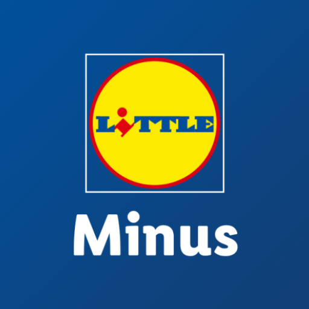

  

<h2 align="center"><b>Little Minus</b></h2>

  Unofficial open-source Lidl Plus client for Android 

  <!-- Latest release -->
  
  <!-- Build and test -->
  

<h3>How it works</h3>

  This app uses the official Lidl Plus API endpoints to log in, display its data and enable coupons.

<h3>Contribution</h3>

  Feel free to contribute by forking the project and opening a PR. If you don't know how to code but want a feature or experience a bug, please <a href="https://github.com/Philipp0002/LittleMinus/issues/new">open an issue</a> so someone else can implement. 

